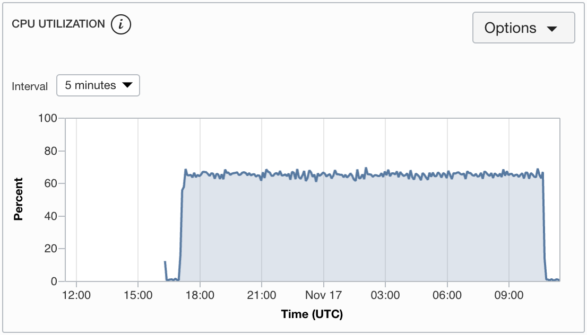
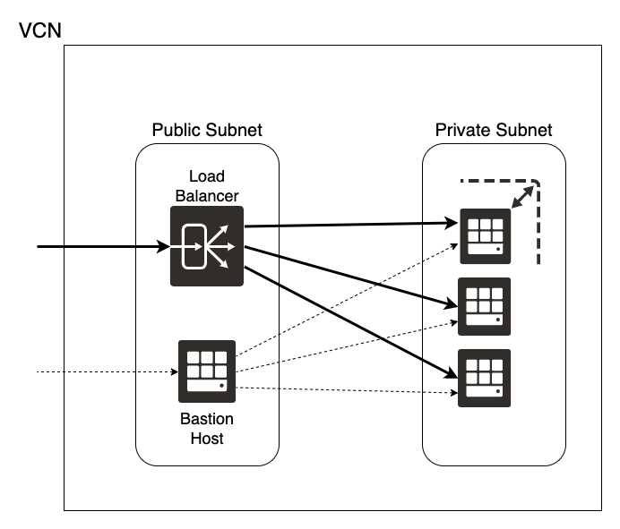

# OCI Autoscaling Getting Started

We are going to create an Instance Pool and enable Autoscaling.

We are going to add a Load Balancer to dispatch request to the instances evenly.

> Keep in mind that to create an instance configuration that includes the custom setup from an instance, you must first create a custom image from the instance, and then use the custom image to launch a new instance. Finally, create the instance configuration based on the instance that you created from the custom image.

The final result should give you the CPU stress metrics:

A busy Load Balancer:

And a scale out and in of the Intance Pool:

## Build the App

Under `src` we have a Java application:

`./gradlew shadowDistZip`

It is going to generate a file `build/distributions/prime-factors-shadow-0.1.zip`

## Environment

We need a Virtual Cloud Network with public and private subnet.

On the public subnet we will set up the public load balancer and the bastion host.

On the private subnet we will start with a VM template.

The creation of resources will be something like this:

`Configured VM` -> `Custom Image` -> `Brand new VM` -> `Instance Configuration` -> `Instance Pool` -> `Autoscaling`

### Create bastion host

Provision a bastion host on the public subnet, assign public IP address and add public ssh key.

On your computer add the private ssh key with `ssh-add -K ~/.ssh/id_rsa`.

### Create VM template

SSH into the bastion host `ssh -A opc@<bastion_host_ip>`

SSH jump into our backend host, in my example: `ssh opc@10.0.1.2`

Bring the host up to date with `sudo yum update -y` and install JDK 14 `sudo yum install jdk-14 -y`.

Add port `8080/tcp` on the local firewall with:

- `sudo firewall-cmd --zone=public --add-port=8080/tcp --permanent`
- `sudo firewall-cmd --reload`

Copy the files to the virtual machine through the bastion host.

Zip file with the application:

`scp -o "ProxyCommand ssh -W %h:%p opc@<bastion_host_ip>" src/prime-factors/build/distributions/prime-factors-shadow-0.1.zip opc@<private_server_ip>:/home/opc`

Unit file to set it up as a service:
`scp -o "ProxyCommand ssh -W %h:%p opc@<bastion_host_ip>" src/prime-factors/primefactor.service opc@<private_server_ip>:/home/opc`

Unzip the file:

`unzip prime-factors-shadow-0.1.zip`

Move the file to the `systemd` folder:

`sudo mv primefactor.service /etc/systemd/system/`

Reload, enable, start and check the status with `systemctl`:

`sudo systemctl daemon-reload`
`sudo systemctl enable primefactor.service`
`sudo systemctl start primefactor.service`
`sudo systemctl status primefactor.service`

Check the logs with `journalctl -f -u primefactor`

> TODO create `Custom Image` -> `Brand new VM` -> `Instance Configuration` -> `Instance Pool`

Create a custom image from the running instance. (Downtime expected)

Then, use the custom image to launch a new instance.

Create a Instance Configuration from the brand new instance.

Finally, create an instance pool on all the Availability Domains of your region. (Some regions only have one AD, if so... pay attention to Fault Domains).

## Autoscale on

Create an autoscaling configuration from the instance pool.

## Load Balancer

Create a Load Balancer 100 Mbps on the same VCN, and public subnet, as the bastion host.

Don't add the backend configuration initially, we will do this later.

Make sure you set the proper Health Check on `HTTP on port 8080, GET /factorization/1 200 OK`.

Listener, for simplicity, on `HTTP` port `80`.

## Stress CPU to scale out

Create a new instance to act as stressor.

For creating stress on the system we are going to use [Apache Benchmark](https://httpd.apache.org/docs/2.4/programs/ab.html)

Provision a linux instance on the private subnet and install the Apache tools:

`sudo yum update`

`sudo yum install httpd-tools`

Run `ab` with:

`ab -n 5000000 -c 100 http://<loadbalancer_public_ip>:8080/factorization/12345678909`

To run in the background:

`nohup ab -n 5000000 -c 100 http://<loadbalancer_public_ip>:8080/factorization/12345678909 > ab.log 2>&1 &`
