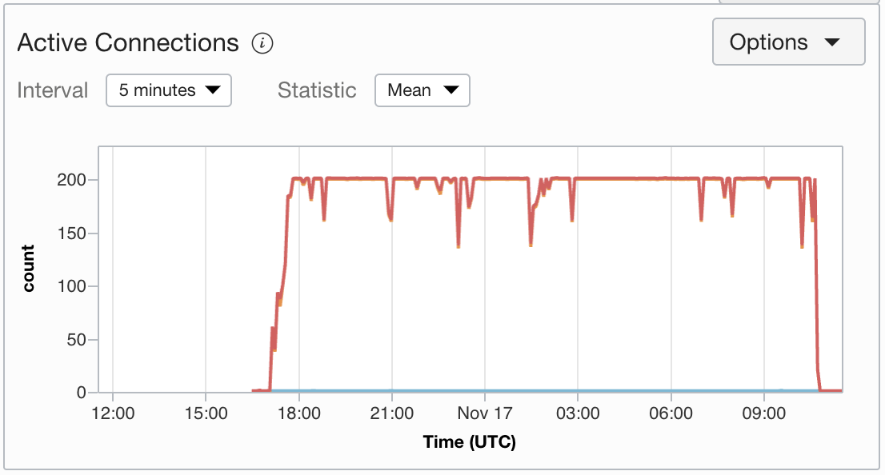

# OCI Autoscaling Getting Started

Autoscaling is the ability to set thresholds on your initial number of resources, monitor those thresholds and react when they are reached. For example, a virtual machine with a 60% CPU utilization threshold can tell you it is the moment to bring more power to the table. Oracle Cloud allow you to do that in few clicks, and this is how.

We will create an Instance Pool and enable Autoscaling.

We will add a Load Balancer to dispatch request to the instances evenly.

> Keep in mind that to create an instance configuration that includes the custom setup from an instance, you must first create a custom image from the instance and then use the custom image to launch a new instance. Finally, create the instance configuration based on the instance that you created from the custom image.

The final result should give you the CPU stress metrics:

A busy Load Balancer:

The Intance Pool size should scale out and then in:

## Build the App

Under `src/prime-factors` we have a simple Java application that calculates prime factors for a given number through a RESTful endpoint.

We can generate the distributable zip with everything needed to run the application with `gradle`:

`./gradlew shadowDistZip`

It is going to generate a file `build/distributions/prime-factors-shadow-0.1.zip`

## Environment

We need a Virtual Cloud Network with a public and a private subnet.

On the public subnet, we will set up the public load balancer and the bastion host.

On the private subnet, we will start with a VM template where we will install the Java application and add an ingress rule on the local firewall.

We will add a Load Balancer with a public IP to reach the JAVA app running on the VMs.

We will use the Bastion host for secure access to private machines inside the private subnet.

The road we are taking will help you to create resources needed, something like this:

`Configured VM` -> Create a `Custom Image` -> Generate a `Brand new VM` -> Create an `Instance Configuration` -> Create an `Instance Pool` -> Enable `Autoscaling`

### Create bastion host

Provision a bastion host on the public subnet, assign a public IP address and add public ssh key.

On your computer, add the private ssh key with `ssh-add -K ~/.ssh/id_rsa`.

### Create VM template

Provision a VM that we will configure with the JAVA app and the firewall rule.

> Improvement: Use Terraform and Ansible

SSH into the bastion host `ssh -A opc@<bastion_host_ip>`

SSH jump into our new VM host, in my example: `ssh opc@10.0.1.2`

Bring the host up to date with `sudo yum update -y` and install JDK 14 `sudo yum install jdk-14 -y`.

Add port `8080/tcp` on the local firewall with:

- `sudo firewall-cmd --zone=public --add-port=8080/tcp --permanent`
- `sudo firewall-cmd --reload`

Copy the files to the virtual machine through the bastion host.

Zip file with the application, from your local machine:

`scp -o "ProxyCommand ssh -W %h:%p opc@<bastion_host_ip>" src/prime-factors/build/distributions/prime-factors-shadow-0.1.zip opc@<private_server_ip>:/home/opc`

Unit file to set it up the app as a service:
`scp -o "ProxyCommand ssh -W %h:%p opc@<bastion_host_ip>" src/prime-factors/primefactor.service opc@<private_server_ip>:/home/opc`

Unzip the file:

`unzip prime-factors-shadow-0.1.zip`

Move the file to the `systemd` folder:

`sudo mv primefactor.service /etc/systemd/system/`

Reload, enable, start and check the status with `systemctl`:

`sudo systemctl daemon-reload`
`sudo systemctl enable primefactor.service`
`sudo systemctl start primefactor.service`
`sudo systemctl status primefactor.service`

Check the logs with `journalctl -f -u primefactor`

## Create Instance Pool and Enable Autoscaling

Create a custom image from the running instance. (Downtime expected)

Then, use the custom image to launch a new instance.

Create an Instance Configuration from the brand new instance.

Finally, create an instance pool on all the Availability Domains of your region. (Some regions only have one AD, if so... pay attention to Fault Domains).

Create an autoscaling configuration from the instance pool.

## Load Balancer

Create a Load Balancer on the same VCN and public subnet as the bastion host.

Don't add the backend configuration initially; we will do this later.

Ensure you set the proper Health Check on `HTTP on port 8080, GET /factorization/1 200 OK`.

Listener, for simplicity, on `HTTP` port `80`.

## Stress CPU to scale out

Create a new instance to act as a stressor.

For creating stress on the system, we are going to use [Apache Benchmark](https://httpd.apache.org/docs/2.4/programs/ab.html)

Provision a Linux instance on the private subnet and install the Apache tools:

`sudo yum update`

`sudo yum install httpd-tools`

Run `ab` with:

`ab -n 5000000 -c 100 http://<loadbalancer_public_ip>:8080/factorization/12345678909`

To run in the background:

`nohup ab -n 5000000 -c 100 http://<loadbalancer_public_ip>:8080/factorization/12345678909 > ab.log 2>&1 &`

---

**You are ready for Black Friday!!**
